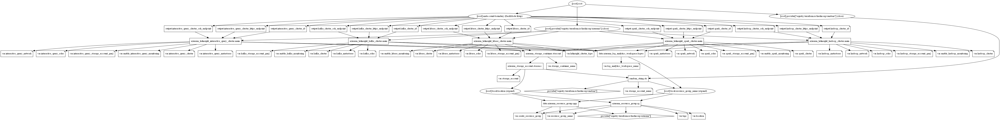

# Azure HDInsight Terraform Module

Terraform module to create managed, full-spectrum, open-source analytics service Azure HDInsight. This module creates Apache Hadoop, Apache Spark, Apache HBase, Interactive Query (Apache Hive LLAP) and Apache Kafka clusters.

## Resources supported

- [Apache Spark Cluster](https://registry.terraform.io/providers/hashicorp/azurerm/latest/docs/resources/hdinsight_spark_cluster)
- [Apache Hadoop Cluster](https://registry.terraform.io/providers/hashicorp/azurerm/latest/docs/resources/hdinsight_hadoop_cluster)
- [Apache HBase Cluster](https://registry.terraform.io/providers/hashicorp/azurerm/latest/docs/resources/hdinsight_hbase_cluster)
- [Apache Hive LLAP (Interactive Query) Cluster](https://registry.terraform.io/providers/hashicorp/azurerm/latest/docs/resources/hdinsight_interactive_query_cluster)
- [Apache Kafka Cluster](https://registry.terraform.io/providers/hashicorp/azurerm/latest/docs/resources/hdinsight_kafka_cluster)

## Module Usage for HDInsight Hadoop Cluster

```hcl
# Azurerm Provider configuration
provider "azurerm" {
  features {
  }
}

module "hdinsight" {
  source  = "kumarvna/hdinsight/azurerm"
    version = "1.0.0"

  # By default, this module will not create a resource group. Location will be same as existing RG.
  # proivde a name to use an existing resource group, specify the existing resource group name, 
  # set the argument to `create_resource_group = true` to create new resrouce group.
  resource_group_name = "rg-shared-westeurope-01"
  location            = "westeurope"

  # The type of hdinsight cluster to create 
  # Valid values are `hadoop`, `hbase`, `interactive_query`, `kafka`, `spark`.
  hdinsight_cluster_type = "hadoop"

  # Hdinsight hadoop cluster configuration. Gateway credentials must be different from the one used 
  # for the `head_node`, `worker_node` and `zookeeper_node` roles.
  hadoop_cluster = {
    name             = "hadoopdemocluster1"
    cluster_version  = "3.6"
    gateway_username = "acctestusrgw"
    gateway_password = "TerrAform123!"
    hadoop_version   = "2.7"
    tier             = "Standard"
  }

  # Node configuration
  # Either a password or one or more ssh_keys must be specified - but not both.
  # Password must be at least 10 characters in length and must contain digits,uppercase, 
  # lower case letters and non-alphanumeric characters 
  hadoop_roles = {
    vm_username = "acctestusrvm"
    vm_password = "AccTestvdSC4daf986!"
    head_node = {
      vm_size = "Standard_D3_V2"
    }
    worker_node = {
      vm_size               = "Standard_D4_V2"
      target_instance_count = 3
      autoscale = {
        capacity = {
          max_instance_count = 4
          min_instance_count = 3
        }
      }
    }
    zookeeper_node = {
      vm_size = "Standard_D3_V2"
    }
  }

  # Use Azure Monitor logs to monitor HDInsight clusters. Recommended to place both the HDInsight 
  # cluster and the Log Analytics workspace in the same region for better performance.
  enable_hadoop_monitoring     = true
  log_analytics_workspace_name = "loganalytics-we-sharedtest2"

  # Tags for Azure Resources
  tags = {
    Terraform   = "true"
    Environment = "dev"
    Owner       = "test-user"
  }
}
```

## Module Usage examples for

- [Hdinsight Hadoop Cluster](examples/hdinsight_hadoop_cluster/)
- [Hdinsight HBase Cluster](examples/hdinsight_hbase_cluster/)
- [Hdinsight Interactive Query Cluster](examples/hdinsight_interactive_query_cluster/)
- [Hdinsight Kafka Cluster](examples/hdinsight_kafka_cluster/)
- [Hdinsight Spark Cluster](examples/hdinsight_spark_cluster/)

## Requirements

| Name | Version |
|------|---------|
| terraform | >= 0.13 |
| azurerm | >= 2.59.0 |

## Providers

| Name | Version |
|------|---------|
| azurerm | >= 2.59.0 |
| random |>= 3.1.0 |

## Inputs

| Name | Description | Type | Default |
|--|--|--|--|
`create_resource_group` | Whether to create resource group and use it for all networking resources | string | `"false"`
`resource_group_name` | The name of the resource group in which resources are created | string | `""`
`location` | The location of the resource group in which resources are created | string | `""`
`storage_account_name`|The name of the storage account|string|`null`
`storage_container_name`|The name of the storage container|string|``null`
`storage_account`|Manages an Azure Storage Account configuration|object|`{}`
`hdinsight_cluster_type`|Specify the type of hdinsight clusters. Valid values are`hadoop`,`hbase`,`interactive-query`,`kafka`,`spark`|string|`null`|
`hadoop_cluster`|Manages a HDInsight Hadoop Cluster|object|`null`
`hadoop_roles`|Manage node roles for HDInsight Hadoop Cluster|object|`null`
`hadoop_storage_account_gen2`|Specify configuration for Azure Data Lake Storage Gen 2|object|`null`
`hadoop_network`|Specify the networking and private endpoint configuration|object|`null`
`hadoop_metastores`|HDInsight metadata with external data stores, available for`Apache Hive metastore`,`Apache Oozie metastore`, and`Apache Ambari database`|object|`null`
`enable_hadoop_monitoring`|Use Azure Monitor logs to monitor HDInsight hadoop cluster|string|`false`
`log_analytics_workspace_name`|The name of log analytics workspace name|string|`null`
`hbase_cluster`|Manages a HDInsight HBase Cluster|object|`null`
`hbase_roles`|Manage node roles for HDInsight HBase Cluster|object|`null`
`hbase_storage_account_gen2`|Specify configuration for Azure Data Lake Storage Gen 2|object|`null`
`hbase_metastores`|HDInsight metadata with external data stores, available for`Apache Hive metastore`,`Apache Oozie metastore`, and`Apache Ambari database`|object|`null`
`enable_hbase_monitoring`|Use Azure Monitor logs to monitor HDInsight HBase cluster|string|`false`
`kafka_cluster`|Manages a HDInsight Kafka Cluster|object|`null`
`kafka_roles`|Manage node roles for HDInsight Kafka Cluster|object|`null`
`kafka_storage_account_gen2`|Specify configuration for Azure Data Lake Storage Gen 2|object|`null`
`kafka_metastores`|HDInsight metadata with external data stores, available for`Apache Hive metastore`,`Apache Oozie metastore`, and`Apache Ambari database`|object|`null`
`enable_kafka_monitoring`|Use Azure Monitor logs to monitor HDInsight Kafka cluster|string|`false`
`spark_cluster`|Manages a HDInsight Spark Cluster|object|`null`
`spark_roles`|Manage node roles for HDInsight Spark Cluster|object|`null`
`spark_storage_account_gen2`|Specify configuration for Azure Data Lake Storage Gen 2|object|`null`
`spark_network`|Specify the networking and private endpoint configuration|object|`null`
`spark_metastores`|HDInsight metadata with external data stores, available for`Apache Hive metastore`,`Apache Oozie metastore`, and`Apache Ambari database`|object|`null`
`enable_spark_monitoring`|Use Azure Monitor logs to monitor HDInsight Spark cluster|string|`false`
`interactive_query_cluster`|Manages a HDInsight Interactive Query Cluster|object|`null`
`interactive_query_roles`|Manage node roles for HDInsight Interactive Query Cluster|object|`null`
`interactive_query_storage_account_gen2`|Specify configuration for Azure Data Lake Storage Gen 2|object|`null`
`interactive_query_network`|Specify the networking and private endpoint configuration|object|`null`
`interactive_query_metastores`|HDInsight metadata with external data stores, available for`Apache Hive metastore`,`Apache Oozie metastore`, and`Apache Ambari database`|object|`null`
`enable_interactive_query_monitoring`|Use Azure Monitor logs to monitor HDInsight Interactive Query cluster|string|`false`
`tags`|A map of tags to add to all resources|map|`{}`

## Outputs

| Name | Description |
|--|--|
`hadoop_cluster_id`|The ID of the HDInsight Hadoop Cluster
`hadoop_cluster_https_endpoint`|The HTTPS Connectivity Endpoint for this HDInsight Hadoop Cluster
`hadoop_cluster_ssh_endpoint`|The SSH Connectivity Endpoint for this HDInsight Hadoop Cluster
`hbase_cluster_id`|The ID of the HDInsight HBase Cluster
`hbase_cluster_https_endpoint`|The HTTPS Connectivity Endpoint for this HDInsight HBase Cluster
`hbase_cluster_ssh_endpoint`|The SSH Connectivity Endpoint for this HDInsight HBase Cluster
`kafka_cluster_id`|The ID of the HDInsight Kafka Cluster
`kafka_cluster_https_endpoint`|The HTTPS Connectivity Endpoint for this HDInsight Kafka Cluster
`kafka_cluster_ssh_endpoint`|The SSH Connectivity Endpoint for this HDInsight Kafka Cluster
`spark_cluster_id`|The ID of the HDInsight Spark Cluster
`spark_cluster_https_endpoint`|The HTTPS Connectivity Endpoint for this HDInsight Spark Cluster
`spark_cluster_ssh_endpoint`|The SSH Connectivity Endpoint for this HDInsight Spark Cluster
`interactive_query_cluster_id`|The ID of the HDInsight Interactive Query Cluster
`interactive_query_cluster_https_endpoint`|The HTTPS Connectivity Endpoint for this HDInsight Interactive Query Cluster
`interactive_query_cluster_ssh_endpoint`|The SSH Connectivity Endpoint for this HDInsight Interactive Query Cluster

## Resource Graph



## Authors

Originally created by [Kumaraswamy Vithanala](mailto:kumarvna@gmail.com)

## Other resources

- [Azure HDInsight](https://docs.microsoft.com/en-us/azure/hdinsight/)
- [Terraform AzureRM Provider Documentation](https://www.terraform.io/docs/providers/azurerm/index.html)
